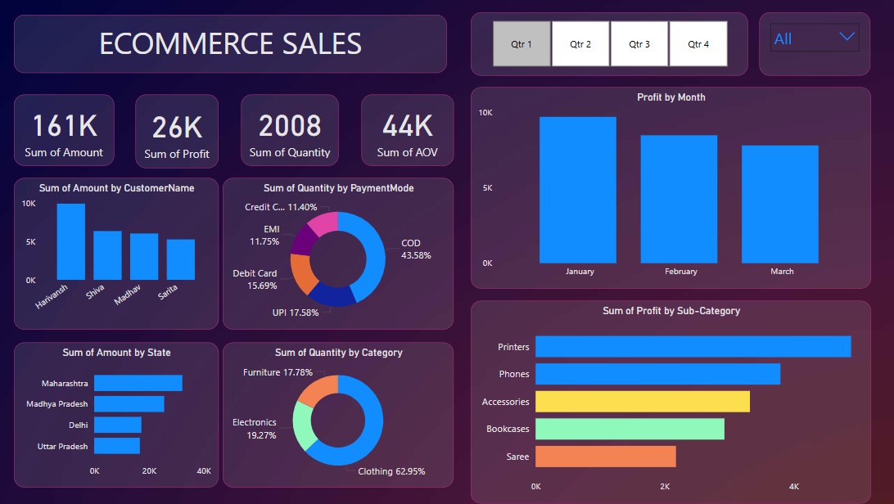

# 📊 E-Commerce Sales Analysis Dashboard

## 🔍 Project Overview
This project involves analyzing eCommerce sales data and creating an **interactive Power BI dashboard** to visualize key metrics, trends, and business insights.

## 🖥️ Dashboard Preview  

## 🛠️ Technologies Used
- **Power BI** for interactive visualizations  
- **SQL / Excel** for data cleaning and transformation  
- **DAX** for custom calculations  

## 🔥 Key Insights
- **Revenue & Profit Trends**: Monthly and quarterly performance tracking  
- **Customer Analysis**: Top buyers and regional sales distribution  
- **Payment Mode Insights**: Breakdown of customer payment preferences  
- **Category & Sub-Category Analysis**: Best-selling products and profit contributors
